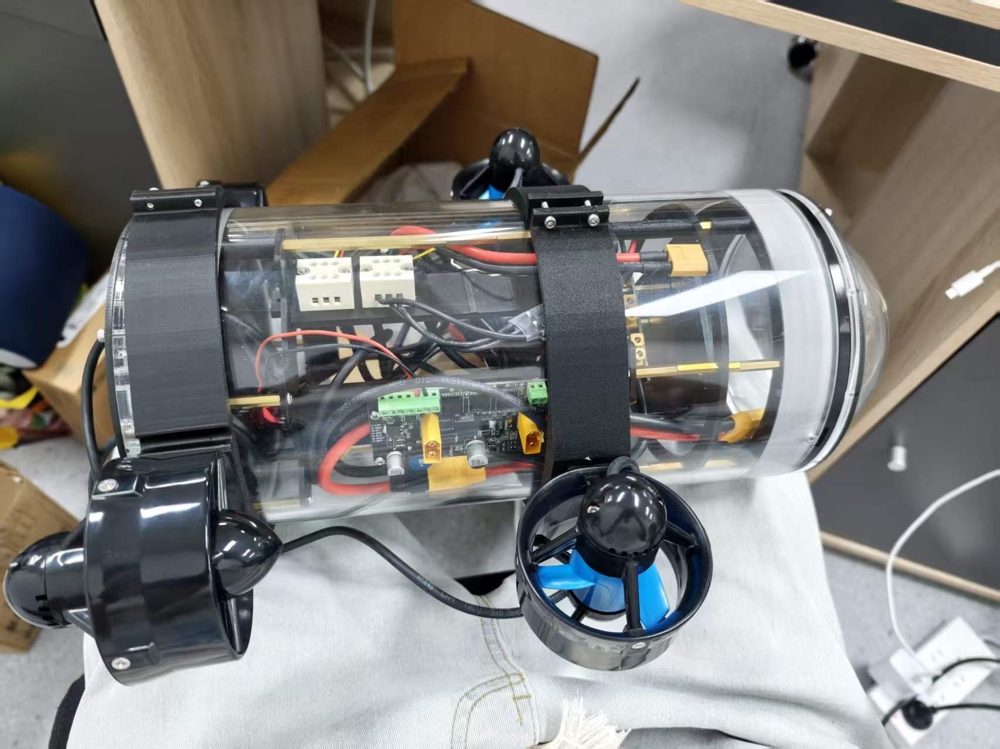

# AUV-CavePI

独立完成的水下机器人原型工程，当前重点是把机械结构、电源与密封方案推进到可复现、可检查的实物阶段。仓库保留 CAD、装配、电源管理、问题定位与测试记录，并明确区分已经验证的结果和仍待验证的能力。

## 项目概览

CavePI 采用 **160 × 300 mm 亚克力圆筒密封舱**、**3 个推进器**与 **14.8 V 4S 电源**。内部结构使用一体抽拉式支撑方案：支撑架一端与法兰配合，另一端不与法兰连接，可整体抽出，以降低安装、接线和维护难度。

本项目由我独立完成，工作覆盖：

- 根据密封舱与实物装配条件持续迭代 CAD，处理支撑结构、板卡布局、接口避让、推进器夹具和线槽等问题；
- 设计并试装一体抽拉式内部支撑，在有限舱内空间中兼顾固定、布线与维护；
- 规划 14.8 V 4S 电源路径及主干、分支接口，记录方案变化与待验证的带载能力；
- 完成穿线螺栓封灌、整机装配、漏点诊断和后续密封处理；
- 通过日志持续记录测试边界、失败现象、整改过程与下一步验证计划。

## 工程迭代

### 机械与 CAD

早期结构方案经过加工可行性和成本评估后转向 160 × 300 mm 成品亚克力密封舱，并据此调整内部支撑和外部安装结构。实物试装暴露了铜柱配合、螺母沉孔、接口干涉和内部高度等问题；CAD 随试装结果迭代，最终采用更便于接线和维护的一端法兰配合式一体抽拉支撑。

### 电源与推进布局

系统以 14.8 V 4S 电池为主电源，围绕电源管理、分电与下游负载规划供电路径。原型配置 3 个推进器；电源接口、线束空间和后续整机带载能力仍按工程日志继续核对，不把方案设计等同于性能验证。

### 密封问题定位

首次整机气密测试中，真空度无法稳定保持。使用泡沫水排查后，将漏点定位到穿线螺栓的线缆周边：封灌不充分且固化期间线缆位移造成开裂。随后对漏点进行二次处理，并在后续复测出现波动后进一步加入线皮打磨粗化、酒精清洁、线缆固定与过夜固化，再进行气密及分段浅水测试。

## 已验证结果

- **负压气密：** 以 15 inHg 为初始真空度保压 15 分钟，读数维持在 14–15 inHg。
- **分段浅水水密：** 受水缸尺寸限制，头部与尾部分别浸水 20 分钟；检查时舱内指示纸保持干燥。

以上结果仅对应当时的测试条件和装配状态。

## 尚未完成的验证

- 整机同时、完全浸没测试；
- 更长时间条件下的水密可靠性验证；
- 推进验证；
- 水下姿态控制验证；
- 定深控制验证。

因此，本仓库当前呈现的是水下机器人原型的工程进展，而不是已经完成全部水下能力验证的成品系统。

## 工程记录

- [项目日志汇总](项目日志汇总.md)
- [CAD v2.0 项目日志](<CAD_designs v2.0/项目日志.md>)
- [电源管理项目日志](电源管理/项目日志.md)

## English Summary

**AUV-CavePI is an independently developed underwater-robot prototype.** It uses a 160 × 300 mm acrylic pressure enclosure, three thrusters, a 14.8 V 4S power source, and an integrated slide-out internal support structure. The repository documents CAD iterations, physical assembly, power-distribution planning, and diagnosis and rework of a leak around cable-penetration bolts.

The verified results are deliberately limited to the recorded test conditions: the enclosure held an initial 15 inHg vacuum for 15 minutes while remaining between 14 and 15 inHg; the head and tail were then immersed separately for 20 minutes, and the internal indicator paper remained dry. Full simultaneous immersion of the entire vehicle, long-duration watertightness, propulsion, attitude control, and depth-hold control have **not** yet been validated.
